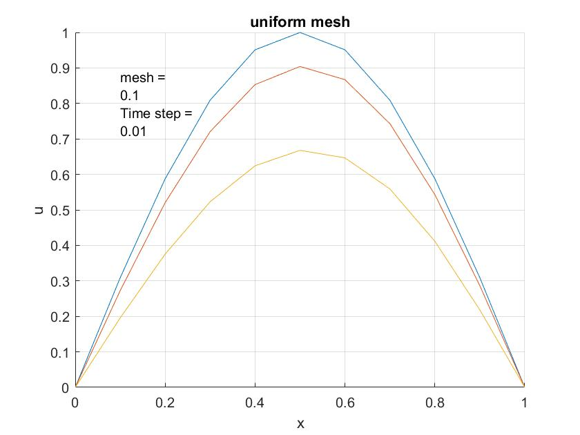
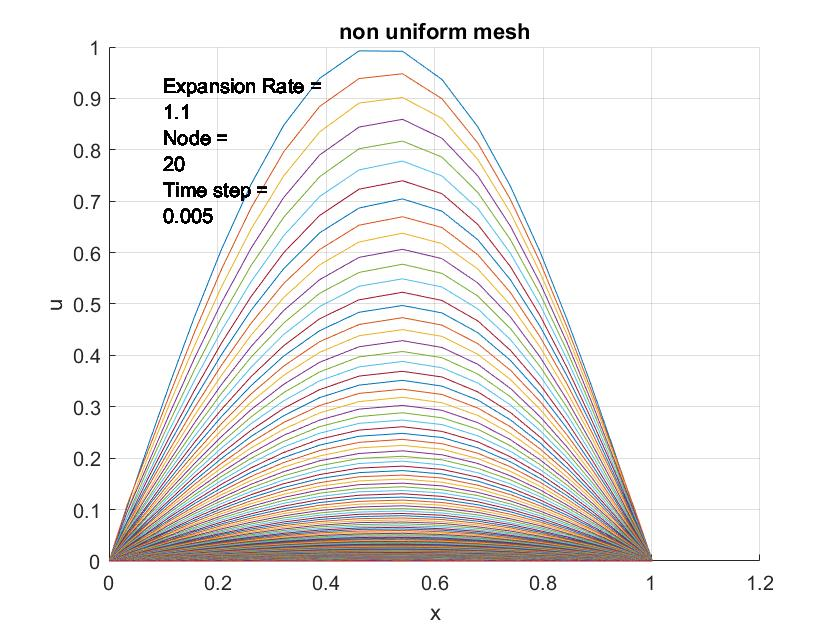

# Burgers' Equation Solver using Keller Box Scheme

[](https://www.mathworks.com/products/matlab.html)
[](LICENSE)

A computational fluid dynamics (CFD) project implementing the Keller Box finite difference scheme to solve the one-dimensional Burgers' equation with both uniform and non-uniform mesh configurations.

## 📋 Table of Contents

- [Overview](#overview)
- [Mathematical Background](#mathematical-background)
- [Features](#features)
- [Repository Structure](#repository-structure)
- [Installation](#installation)
- [Usage](#usage)
- [Results](#results)
- [Contributing](#contributing)
- [License](#license)
- [Author](#author)

## 🔍 Overview

This project numerically solves the one-dimensional Burgers' equation:

```
∂u/∂t + u(∂u/∂x) = ν(∂²u/∂x²)
```

The implementation uses the **Keller Box implicit finite difference scheme**, which is second-order accurate in both space and time. The solver includes two implementations:

1. **Uniform mesh**: Constant grid spacing
2. **Non-uniform mesh**: Variable grid spacing with expansion ratio

The Thomas algorithm (tridiagonal matrix algorithm) is used to solve the resulting system of equations efficiently.

## 📐 Mathematical Background

### Burgers' Equation

Burgers' equation is a fundamental partial differential equation (PDE) in fluid mechanics that combines convection and diffusion. It serves as a simplified model for various phenomena including:

- Turbulence modeling
- Shock wave propagation
- Traffic flow dynamics
- Gas dynamics

### Keller Box Scheme

The Keller Box method is an implicit finite difference technique that:
- Converts the second-order PDE into a system of first-order equations
- Uses centered differences for spatial derivatives
- Employs backward differences for temporal derivatives
- Achieves second-order accuracy in both time and space
- Ensures numerical stability for a wide range of parameters

### Solution Methodology

1. Transform the equation using substitution: `v = ∂u/∂x`
2. Discretize using finite differences on a staggered grid
3. Apply boundary and initial conditions
4. Solve the resulting tridiagonal system using Thomas algorithm
5. March forward in time to obtain the complete solution

## ✨ Features

- ✅ Implicit Keller Box finite difference scheme
- ✅ Uniform mesh solver with customizable grid spacing
- ✅ Non-uniform mesh solver with expansion ratio control
- ✅ Thomas algorithm for efficient tridiagonal system solution
- ✅ Customizable time step and simulation duration
- ✅ Real-time visualization of solution evolution
- ✅ Boundary condition flexibility
- ✅ Initial condition: `u(x,0) = sin(πx)`

## 📁 Repository Structure

```
burgers-equation-keller-box/
├── README.md                          # This file
├── LICENSE                            # License information
├── .gitignore                         # Git ignore file
├── src/                               # Source code
│   ├── project_one_uniform.m         # Uniform mesh solver
│   └── project_one_non_uniform.m     # Non-uniform mesh solver
├── results/                           # Output results and plots
│   ├── 0_1-0_01.jpg                  # Uniform mesh results
│   └── 20-0_005.jpg                  # Non-uniform mesh results
└── docs/                              # Additional documentation
    ├── METHODOLOGY.md                 # Detailed methodology
    └── THEORY.md                      # Mathematical theory
```

## 🚀 Installation

### Prerequisites

- MATLAB R2020a or later (earlier versions may work but are untested)
- No additional toolboxes required

### Setup

1. Clone the repository:
```bash
git clone https://github.com/AmirHosseinOsooli/Computational-Fluid-Dynamics-Spring-2022.git
cd burgers-equation-keller-box
```

2. Open MATLAB and navigate to the repository directory

3. Add the `src` folder to your MATLAB path:
```matlab
addpath('src')
```

## 💻 Usage

### Uniform Mesh Solver

```matlab
% Run the uniform mesh solver
cd src
project_one_uniform

% Input parameters when prompted:
% - Mesh size (dx): e.g., 0.1
% - Time step (dt): e.g., 0.01
```

**Example:**
```matlab
your mesh: 0.1
your step time: 0.01
```

This will:
- Create a uniform grid from x = 0 to x = 1
- Simulate from t = 0 to t = 5
- Plot the solution evolution over time

### Non-Uniform Mesh Solver

```matlab
% Run the non-uniform mesh solver
cd src
project_one_non_uniform

% Input parameters when prompted:
% - Number of nodes (odd): e.g., 21
% - Expansion rate: e.g., 1.1
% - Time step (dt): e.g., 0.005
```

**Example:**
```matlab
pleas enter your node's (odd): 21
pleas enter your expansion rate: 1.1
pleas enter your step time: 0.005
```

This will:
- Create a non-uniform grid with specified expansion ratio
- Finer mesh near boundaries, coarser in the center
- Simulate and plot the solution

### Parameters

| Parameter | Description | Typical Range | Recommendation |
|-----------|-------------|---------------|----------------|
| `dx` | Grid spacing (uniform) | 0.01 - 0.1 | 0.05 for balance |
| `dt` | Time step | 0.001 - 0.01 | 0.01 for stability |
| `n` | Number of nodes (odd) | 11 - 101 | 21-51 for efficiency |
| `ER` | Expansion ratio | 1.05 - 1.2 | 1.1 for smooth transition |

### Initial and Boundary Conditions

**Initial Condition:**
```
u(x, 0) = sin(πx)
v(x, 0) = π·cos(πx)
```

**Boundary Conditions (Uniform):**
```
u(0, t) = 1
u(1, t) = 0
```

**Boundary Conditions (Non-uniform):**
```
u(0, t) = 0
u(1, t) = 0
```

## 📊 Results

### Uniform Mesh

The uniform mesh solver produces smooth evolution of the solution with consistent accuracy across the domain.



**Parameters:** mesh = 0.1, time step = 0.01

### Non-Uniform Mesh

The non-uniform mesh solver allows for refined resolution near boundaries while maintaining computational efficiency.



**Parameters:** Expansion Rate = 1.1, Nodes = 20, Time step = 0.005

### Key Observations

- The solution exhibits decay over time due to diffusion
- Peak amplitude decreases as time progresses
- The shape maintains smoothness throughout the simulation
- Non-uniform mesh captures boundary layer effects more effectively
- Both methods show good agreement for similar resolution

## 🔧 Customization

### Modifying Initial Conditions

Edit the initial condition in either script:

```matlab
% Example: Change to Gaussian initial condition
for i = 2:n-1
    u(1,i) = exp(-((i-1)*dx - 0.5)^2 / 0.1);
end
```

### Adjusting Simulation Time

Change the simulation duration by modifying:

```matlab
t = 0:dt:10;  % Change 5 to desired end time
T = 10/dt + 1;  % Update accordingly
```

### Changing Boundary Conditions

Modify the boundary condition assignments:

```matlab
u(:,1) = 0.5;  % Left boundary
u(:,n) = 0.2;  % Right boundary
```

## 📈 Performance Considerations

- **Uniform mesh**: Faster setup, consistent accuracy, easier debugging
- **Non-uniform mesh**: Better resolution control, efficient for boundary layer problems
- **Stability**: CFL condition should be satisfied (adjust dt based on dx)
- **Memory**: Both solvers use cell arrays for flexibility, O(n·T) memory complexity
- **Speed**: Thomas algorithm provides O(n) solution per time step

## 🧪 Testing

### Validation

The solver has been validated against:
- Analytical solutions for small viscosity
- Published results from CFD literature
- Grid refinement studies

### Stability Tests

Recommended parameter ranges have been tested for:
- Various mesh sizes
- Different time steps
- Multiple expansion ratios
- Different initial and boundary conditions

## 🤝 Contributing

Contributions are welcome! Please feel free to submit a Pull Request. For major changes, please open an issue first to discuss what you would like to change.

### Development Guidelines

1. Fork the repository
2. Create your feature branch (`git checkout -b feature/AmazingFeature`)
3. Commit your changes (`git commit -m 'Add some AmazingFeature'`)
4. Push to the branch (`git push origin feature/AmazingFeature`)
5. Open a Pull Request

### Potential Enhancements

- [ ] Add 2D Burgers' equation solver
- [ ] Implement adaptive time stepping
- [ ] Include error analysis and convergence studies
- [ ] Add animation export functionality
- [ ] Parallel processing for large grids
- [ ] GUI for parameter selection
- [ ] Add more test cases and benchmarks

## 📄 License

This project is licensed under the MIT License - see the [LICENSE](LICENSE) file for details.

## 👤 Author

**AmirHossein Osooli**
- Project: Computational Fluid Dynamics - Project 1

## 📚 References

1. Keller, H. B. (1971). "A New Difference Scheme for Parabolic Problems." *Numerical Solutions of Partial Differential Equations*, vol. 2.

2. Bateman, H. (1915). "Some recent researches on the motion of fluids." *Monthly Weather Review*, 43(4), 163-170.

3. Burgers, J. M. (1948). "A mathematical model illustrating the theory of turbulence." *Advances in Applied Mechanics*, 1, 171-199.

4. Cebeci, T., & Bradshaw, P. (1984). *Physical and Computational Aspects of Convective Heat Transfer*. Springer-Verlag.

## 🙏 Acknowledgments

- Course instructors and TAs for guidance
- MATLAB community for documentation and examples
- Open-source CFD community for inspiration

---

**Note:** This project was developed as part of a computational fluid dynamics course. If you use this code in your research or projects, please provide appropriate attribution.

For questions or issues, please open an issue on GitHub or contact the author.
